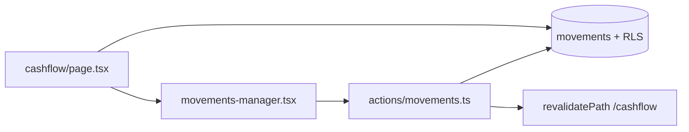

# Design: sezione Cashflow (movimenti personali)

**Data:** 2026-06-04  
**Stato:** approvato in brainstorming  
**Progetto:** Hestia (Next.js 16, Supabase, shadcn/ui)

## Obiettivo

Aggiungere la prima sezione operativa dell’app: **Cashflow**, in cui ogni utente autenticato registra **entrate** e **uscite** personali, consulta i **movimenti** del mese selezionato e vede i totali mensili (entrate, uscite, netto).

## Requisiti funzionali

| ID | Requisito |
|----|-----------|
| R1 | Ogni utente vede e gestisce **solo i propri** movimenti |
| R2 | Vista predefinita: **mese corrente**; possibilità di cambiare mese (‹ › + etichetta, es. «Giugno 2026») |
| R3 | Sopra la lista: totali del mese — **Entrate**, **Uscite**, **Netto** (entrate − uscite) |
| R4 | Lista movimenti come elemento principale; ordinamento `occurred_on` DESC, poi `created_at` DESC |
| R5 | Aggiungere movimento (entrata o uscita) tramite dialog |
| R6 | Modificare ed eliminare movimento (menu riga + conferma eliminazione) |
| R7 | Campi obbligatori v1: data, importo (> 0), descrizione (non vuota), tipo entrata/uscita |

## Fuori scope (v1)

- Categorie, tag, note estese
- Movimenti ricorrenti
- Registro condiviso tra utenti
- Multi-valuta
- Allegati
- Budget / obiettivi / confronto con limiti
- Raggruppamento per giorno in UI (opzionale v2)

## Terminologia UI (italiano)

| Concetto | Label UI | Note |
|----------|----------|------|
| Sezione | Cashflow | Voce di navigazione |
| Record singolo | Movimento | Dialog: «Aggiungi movimento» |
| Lista | Movimenti | Sottotitolo card se utile |
| Tipo positivo | Entrata | |
| Tipo negativo | Uscita | |
| Differenza mensile | Netto | Sottotitolo opzionale: «entrate − uscite»; colore verde se ≥ 0, rosso se < 0 |

**Nome tabella DB:** `movements` (tecnico). **Enum tipo:** `income` | `expense` (mapping UI entrata/uscita).

## Approccio UX scelto

**Pagina registro** (allineata a `/users`):

- `Card` con header sezione
- Selettore mese + tre metriche in riga
- `Table` movimenti + `Dialog` per creazione/modifica
- Menu `⋯` per modifica/elimina (pattern `MembersManager`)

Alternative scartate: lista solo a card (mobile-first duplicato); vista «estratto conto» raggruppata per giorno (più complessa, meno coerente con il resto dell’app).

## Architettura applicativa

### Routing e navigazione

- Route protetta: `/cashflow`
- Query string mese: `/cashflow?month=YYYY-MM` (default: mese calendario corrente, timezone **Europe/Rome** in v1)
- Aggiungere voce **Cashflow** in `components/layout/app-nav.tsx` (visibile a tutti gli utenti autenticati, non solo admin)

### Rendering (Next.js App Router)

- `app/(protected)/cashflow/page.tsx`: **Server Component** — valida `month`, carica movimenti e aggregati, passa dati al client manager
- `components/cashflow/movements-manager.tsx`: **Client Component** — tabella, dialog, selettore mese (navigazione via `router.push` / link con `searchParams`), toast
- `app/actions/movements.ts`: Server Actions per create, update, delete (validazione server-side, `revalidatePath` su `/cashflow`)

### Flusso dati



## Modello dati (Supabase / Postgres)

### Tabella `public.movements`

| Colonna | Tipo | Vincoli |
|---------|------|---------|
| `id` | `uuid` | PK, default `gen_random_uuid()` |
| `user_id` | `uuid` | NOT NULL, FK → `auth.users(id)` ON DELETE CASCADE |
| `type` | `text` | NOT NULL, CHECK (`income`, `expense`) |
| `amount` | `numeric(12,2)` | NOT NULL, CHECK (`amount` > 0) |
| `occurred_on` | `date` | NOT NULL |
| `description` | `text` | NOT NULL, CHECK (trim ≠ '') |
| `created_at` | `timestamptz` | NOT NULL, default `now()` |
| `updated_at` | `timestamptz` | NOT NULL, default `now()` |

Indice consigliato: `(user_id, occurred_on DESC)`.

### RLS

- `SELECT` / `INSERT` / `UPDATE` / `DELETE`: `user_id = auth.uid()`

### Aggregati mensili

Calcolati lato server (SQL o query Supabase separate) per il mese `[first_day, last_day]` filtrato su `occurred_on`:

- `total_income` = SUM(`amount`) WHERE `type = 'income'`
- `total_expense` = SUM(`amount`) WHERE `type = 'expense'`
- `net` = `total_income` - `total_expense`

## Layout schermata

```
┌─────────────────────────────────────────────┐
│ Cashflow                    [+ Movimento]   │
│  ‹  Giugno 2026  ›                            │
├─────────────────────────────────────────────┤
│  Entrate      Uscite       Netto             │
│  € …          € …          € …               │
├─────────────────────────────────────────────┤
│  Data | Descrizione | Tipo | Importo | ⋯   │
│  …                                          │
└─────────────────────────────────────────────┘
```

- Importo in tabella: prefisso **+** per entrate, **−** per uscite (amount sempre positivo in DB)
- **Empty state:** messaggio per mese vuoto + CTA «Aggiungi movimento»
- Responsive: tabella con scroll orizzontale su viewport stretti se necessario; colonne minime Data, Descrizione, Importo

## Form «Aggiungi / Modifica movimento»

- **Dialog** shadcn (stesso pattern di `/users`)
- Toggle o tab: **Entrata** | **Uscita**
- Campi con label sopra (no placeholder-as-label):
  - Data (`type="date"`, default oggi in creazione)
  - Importo (`inputMode="decimal"`, formato € IT)
  - Descrizione (`text`, max length ragionevole es. 500)
- Validazione on blur lato client dove utile; validazione autoritativa in Server Action
- Toast successo/errore via **sonner**

## Errori e sicurezza

- Messaggi errore specifici (importo non valido, descrizione vuota, mese non valido)
- Non esporre movimenti di altri utenti (RLS + verifica `user_id` nelle action su update/delete)
- `month` query param: parse strict `YYYY-MM`; fallback mese corrente se assente o invalido

## Test manuali (da aggiungere a `docs/MANUAL_TEST.md` in implementazione)

1. Utente A crea entrata/uscita nel mese corrente → totali e riga in lista corretti
2. Cambio mese ‹ › → lista e totali solo per quel mese
3. Utente B non vede movimenti di A
4. Modifica descrizione/importo → lista e totali aggiornati
5. Elimina con conferma → scompare da lista e totali
6. Mese senza movimenti → empty state

## Riferimenti nel codebase

- Pattern admin UI: `app/(protected)/users/page.tsx`, `components/users/members-manager.tsx`
- Layout protetto: `app/(protected)/layout.tsx`, `components/layout/app-nav.tsx`
- Auth utente corrente: `lib/supabase/server.ts`, `getCurrentMember` dove serve contesto membro

## Decisioni registrate (brainstorming)

| Domanda | Decisione |
|---------|-----------|
| Focus schermata | Lista movimenti (con riepilogo mensile compatto sopra) |
| Periodo | Mese corrente + navigazione mese |
| Totali | Entrate, Uscite, Netto |
| Visibilità dati | Personale per utente (v1) |
| Netto vs «guadagno» | Label **Netto** |
| Descrizione | Obbligatoria |
| CRUD | Create + update + delete in v1 |
