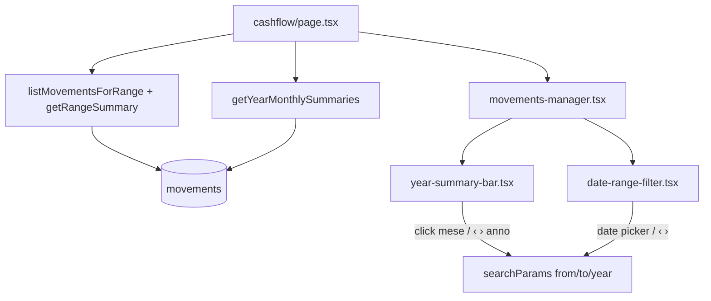

# Design: filtri temporali Cashflow e riepilogo annuale

**Data:** 2026-06-04  
**Stato:** approvato in brainstorming  
**Progetto:** Hestia (Next.js 16, Supabase, shadcn/ui)  
**Estende:** `2026-06-04-cashflow-design.md`

## Obiettivo

Rivedere i filtri temporali del Cashflow: intervallo preciso inizio/fine per la griglia movimenti, riepilogo annuale compatto sopra con navigazione per anno e mesi cliccabili. Il riepilogo annuale e il filtro della griglia sono **indipendenti**, salvo quando l’utente clicca esplicitamente su un mese.

## Requisiti funzionali

| ID | Requisito |
|----|-----------|
| R1 | Filtro griglia: date precise **Da** / **A** (`YYYY-MM-DD`); default = mese corrente (1° → ultimo giorno, timezone **Europe/Rome**) |
| R2 | Totali sotto il filtro (Entrate, Uscite, Netto) calcolati sul range `from`–`to` |
| R3 | Lista movimenti filtrata su `occurred_on` nel range `from`–`to` |
| R4 | Riepilogo annuale sopra: totali anno + 12 mesi (Entrate, Uscite, Netto ciascuno), inclusi mesi futuri (€0 se vuoti) |
| R5 | Navigazione **‹ ›** sull’**anno** nel riepilogo: cambia solo l’anno visualizzato nel riepilogo, **non** modifica `from`/`to` |
| R6 | Click su un mese nel riepilogo: imposta `from`/`to` al mese intero corrispondente (**nell’anno mostrato** nel riepilogo) |
| R7 | Range ibrido: oltre al click mese, i date picker permettono range parziali o cross-mese |
| R8 | Pulsanti **‹ ›** accanto ai date picker spostano il periodo di **un mese intero** (riferimento: mese di `from`) |
| R9 | Mese evidenziato nel riepilogo solo se `from`/`to` coincidono esattamente con un mese intero **dell’anno attualmente mostrato** nel riepilogo |

## Fuori scope

- Preset rapidi (trimestre, ultimi 30 giorni, «anno corrente» sulla griglia)
- Sincronizzazione automatica anno riepilogo ↔ anno del filtro griglia
- Retrocompatibilità con `?month=YYYY-MM` (sostituito da `from`/`to`)
- Modifiche al modello dati o al CRUD movimenti

## Decisioni (brainstorming)

| Domanda | Decisione |
|---------|-----------|
| Libertà date | **Ibrido** — click mese = mese intero; date picker = range libero |
| Anno riepilogo default | Anno di calendario corrente (Europe/Rome) |
| Navigazione anno riepilogo | **‹ ›** sull’anno; indipendente dal filtro griglia |
| Click mese | Aggiorna `from`/`to` (non cambia param `year` del riepilogo) |
| ‹ › date picker | Scorciatoia mese intero precedente/successivo |
| Query param griglia | `from`, `to` (sostituiscono `month`) |
| Query param riepilogo | `year` (default: anno corrente) |

## URL e validazione

| Parametro | Formato | Default | Effetto |
|-----------|---------|---------|---------|
| `from` | `YYYY-MM-DD` | 1° giorno mese corrente | Inizio range griglia |
| `to` | `YYYY-MM-DD` | Ultimo giorno mese corrente | Fine range griglia |
| `year` | `YYYY` (4 cifre) | Anno corrente | Anno mostrato nel riepilogo annuale |

Regole:

- Parse strict; se `from`/`to` assenti o invalidi → default mese corrente.
- Se `from` > `to` → **swap** automatico delle due date (l’utente non perde l’input).
- Se `year` assente o invalido → anno corrente.
- Navigazione ‹ › anno: `router.push` aggiornando solo `year`, preservando `from`/`to`.
- Click mese (es. marzo 2024 nel riepilogo): `from=2024-03-01`, `to=2024-03-31`, preservando `year` del riepilogo.

Esempio: `/cashflow?year=2025&from=2026-06-01&to=2026-06-30` — riepilogo 2025, griglia giugno 2026.

## Layout schermata

```
┌─────────────────────────────────────────────────────────────┐
│ Cashflow                                    [+ Movimento]   │
├─────────────────────────────────────────────────────────────┤
│  ‹  2026  ›   Riepilogo annuale                             │
│  Totale anno: Entrate €…  Uscite €…  Netto €…              │
│  ┌─────┬─────┬─────┬ ... ─── 12 mesi ─── ... ┬─────┐       │
│  │ Gen │ Feb │ Mar │  E / U / N per mese     │ Dic │       │
│  └─────┴─────┴─────┴ ... ────────────────────┴─────┘       │
├─────────────────────────────────────────────────────────────┤
│  ‹  [Da: __/__/____]  [A: __/__/____]  ›                   │
│  Entrate €…    Uscite €…    Netto €…                        │
├─────────────────────────────────────────────────────────────┤
│  Tabella movimenti                                          │
└─────────────────────────────────────────────────────────────┘
```

### Riepilogo annuale (`YearSummaryBar`)

- Header: **‹** anno **›** + label «Riepilogo annuale» (o solo anno centrato tra frecce).
- Riga totali anno (somma dei 12 mesi visualizzati).
- Griglia 12 colonne: abbreviazione mese (Gen, Feb, …), sotto tre valori compatti (Entrate, Uscite, Netto).
- Formato compatto suggerito: valori abbreviati se > 999 (es. `1,2k`), altrimenti intero; netto con colore verde/rosso come oggi.
- Celle cliccabili (`button` o link); stato `aria-current` / bordo per mese evidenziato (R9).
- Desktop: griglia 12 colonne. Mobile: scroll orizzontale sulla riga mesi; totali anno sempre visibili.

### Filtro periodo (`DateRangeFilter`)

- Due input `type="date"` (label **Da** / **A**).
- **‹ ›** laterali: `shiftMonthKey` sul mese di `from`, impostano `from`/`to` al mese intero risultante.
- Aggiornamento URL on blur o on change (debounce breve accettabile).

## Architettura applicativa

### Modifiche routing

- `app/(protected)/cashflow/page.tsx`: legge `from`, `to`, `year` da `searchParams`; carica dati in parallelo.
- `components/cashflow/movements-manager.tsx`: riceve range + dati griglia; compone sotto-componenti.
- Nuovi client components:
  - `components/cashflow/year-summary-bar.tsx`
  - `components/cashflow/date-range-filter.tsx`

### Flusso dati



### Query (`lib/cashflow/queries.ts`)

| Funzione | Descrizione |
|----------|-------------|
| `listMovementsForRange(from, to)` | Sostituisce `listMovementsForMonth`; stesso ordinamento |
| `getRangeSummary(from, to)` | Aggregati sul range |
| `getYearMonthlySummaries(year)` | 12 `MonthSummary` + `YearSummary` (totali anno) |

Implementazione anno: preferire **una query** `occurred_on` tra `YYYY-01-01` e `YYYY-12-31` con aggregazione per mese lato server (SQL `date_trunc` / group by mese, o reduce in TS se volume basso). Riempire mesi senza movimenti con zeri.

### Utility (`lib/cashflow/month.ts` → estendere o `date-range.ts`)

- `getCurrentMonthBounds()` → `{ from, to }` default
- `parseDateRangeParams(from?, to?)` → validazione + default
- `parseYearParam(year?)` → numero anno o corrente
- `monthBoundsForYearMonth(year, month)` → `{ from, to }` per click mese
- `isFullMonthRange(from, to, year, month)` → per evidenziazione R9
- Mantenere `shiftMonthKey` / adattare per date ISO complete

Tipi (`lib/cashflow/types.ts`):

```ts
export type YearSummary = {
  year: number;
  months: Array<{ month: number; monthKey: string } & MonthSummary>;
  totalIncome: number;
  totalExpense: number;
  net: number;
};
```

## Comportamenti edge

| Scenario | Comportamento |
|----------|---------------|
| Riepilogo anno 2024, griglia giugno 2026 | Consentito; nessun mese evidenziato in 2024 |
| Click «Mar» con riepilogo 2024 | `from=2024-03-01`, `to=2024-03-31`; griglia passa a marzo 2024 |
| ‹ › anno nel riepilogo | Solo `year` cambia; griglia invariata |
| Range parziale (es. 10–20 giu) | Nessun mese evidenziato nel riepilogo |
| Mese futuro senza movimenti | Cella riepilogo con €0; cliccabile |
| `from`/`to` cross-anno (15 dic – 10 gen) | Griglia ok; evidenziazione mese solo se match mese intero nell’anno del riepilogo |

## Errori e sicurezza

- Messaggi errore coerenti con cashflow v1 (date non valide).
- RLS invariata; query sempre scoped all’utente autenticato.
- `revalidatePath('/cashflow')` invariato nelle Server Actions.

## Test manuali

1. Apertura `/cashflow` senza query → mese corrente in griglia, riepilogo anno corrente.
2. ‹ › anno nel riepilogo → mesi e totali anno cambiano; griglia invariata.
3. Click mese nel riepilogo → griglia e totali periodo aggiornati a quel mese intero.
4. Date picker range parziale → griglia e totali corretti; nessuna evidenziazione mese.
5. ‹ › accanto date picker → salta al mese intero precedente/successivo.
6. Riepilogo anno passato con movimenti → totali corretti per ogni mese.
7. Responsive: scroll orizzontale mesi su viewport stretto.

## Riferimenti nel codebase

- Implementazione attuale: `app/(protected)/cashflow/page.tsx`, `components/cashflow/movements-manager.tsx`
- Query: `lib/cashflow/queries.ts`, `lib/cashflow/month.ts`
- Spec precedente: `docs/superpowers/specs/2026-06-04-cashflow-design.md`
