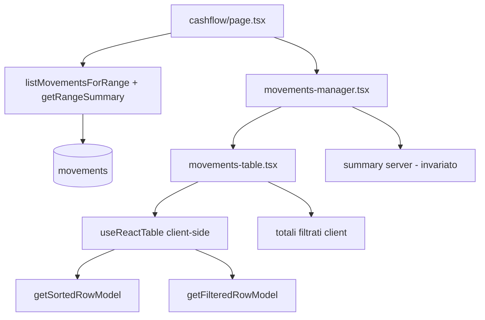

# Design: ordinamento e filtri tabella Cashflow

**Data:** 2026-06-05  
**Stato:** approvato in brainstorming  
**Progetto:** Hestia (Next.js 16, Supabase, shadcn/ui)  
**Estende:** `2026-06-04-cashflow-temporal-filters-design.md`

## Obiettivo

Permettere **ordinamento** e **filtri colonna** sulla tabella movimenti del Cashflow, senza reinventare logica custom: TanStack Table v8 con il pattern Data Table di shadcn/ui. I filtri su Categoria e Descrizione seguono il modello Excel (testo libero + selezione multipla dai valori presenti). I totali del periodo restano invariati; con filtri attivi compare una riga aggiuntiva «Totali filtrati».

## Requisiti funzionali

| ID | Requisito |
|----|-----------|
| R1 | Ordinamento client-side su Data, Categoria, Descrizione, Importo; default **Data discendente** (più recenti in cima) |
| R2 | Filtro colonna su **Categoria** e **Descrizione** con popover stile Excel: testo libero + checkbox sui valori unici del dataset caricato |
| R3 | Con testo libero e checkbox entrambi attivi: logica **AND** (la cella deve essere tra i selezionati **e** contenere il testo) |
| R4 | Totali periodo (Entrate, Uscite, Netto da `summary` server) **sempre** calcolati su tutto il range `from`–`to`, indipendenti dai filtri tabella |
| R5 | Con almeno un filtro colonna attivo: riga **Totali filtrati** (Entrate, Uscite, Netto sulle righe visibili dopo filtro) |
| R6 | Stato sort/filtri in memoria (client); reset sort default + cancellazione filtri al cambio `from` o `to` |
| R7 | Icona filtro evidenziata quando la colonna ha filtro attivo; pulsante «Cancella filtro» nel popover |
| R8 | Empty state dedicato se il filtro esclude tutte le righe, con azione «Cancella filtri» |

## Fuori scope (v1)

- Filtro su Data, Importo, Tipo
- Multi-sort (Shift+click)
- Persistenza sort/filtri in URL
- Paginazione e virtualizzazione
- Filtri server-side (nuove query Supabase)
- Kit generico `components/data-table/` riusabile altrove

## Decisioni (brainstorming)

| Domanda | Decisione |
|---------|-----------|
| Libreria | **@tanstack/react-table** v8 + pattern shadcn Data Table |
| Approccio implementativo | Tabella dedicata cashflow (no astrazione generica) |
| Totali con filtri attivi | **C** — totali periodo fissi + riga «Totali filtrati» |
| Persistenza stato | **B** — locale; reset al cambio periodo |
| Sort multi-colonna | No — singola colonna |
| Valori nulli in filtro | Categoria assente → «—»; descrizione vuota → «—» |

## Libreria e dipendenze

### @tanstack/react-table v8

Scelta allineata alle best practice per React + shadcn:

- Headless: mantiene `Table` shadcn esistente
- `getSortedRowModel()` per ordinamento client-side
- `getFilteredRowModel()` + `getFacetedRowModel()` + `getFacetedUniqueValues()` per popolare le checkbox
- `filterFn` custom per combinare testo libero e multi-select

Alternative scartate:

| Libreria | Motivo scarto |
|----------|---------------|
| AG Grid | Bundle pesante, stile non shadcn, overkill per ~centinaia righe/periodo |
| Material React Table / Mantine React Table | Design system diverso da shadcn |
| Custom `useMemo` | Reinventa sorting/filtri/UI header — esplicitamente da evitare |

### Componenti shadcn da aggiungere

- `popover` — pannello filtro nell’header colonna
- `checkbox` — selezione multipla valori

Già presenti e riusati: `table`, `button`, `input`, `dropdown-menu`.

## Architettura applicativa

### File

| File | Responsabilità |
|------|----------------|
| `components/cashflow/movements-table.tsx` | `useReactTable`, rendering righe, totali filtrati, reset su cambio periodo |
| `components/cashflow/movements-table-columns.tsx` | `ColumnDef<Movement>[]`, accessor, `filterFn`, header sortable |
| `components/cashflow/column-faceted-filter.tsx` | Popover riusabile: search + checkbox + cancella |
| `components/cashflow/movements-manager.tsx` | Compone tabella; mantiene dialog CRUD, filtri temporali, totali periodo |

### Flusso dati



- **Nessuna modifica** a `page.tsx`, query Supabase o Server Actions.
- I movimenti restano caricati per `from`/`to`; sort/filter operano sul subset in memoria.

### Tipo filtro colonna

```ts
export type FacetedColumnFilterValue = {
  search: string;
  selectedValues: string[];
};
```

`filterFn` per Categoria e Descrizione:

1. Normalizza il valore cella per display (`category_name ?? "—"`, `description.trim() || "—"`).
2. Se `selectedValues.length > 0` e il valore non è incluso → escludi riga.
3. Se `search.trim()` non vuoto e il valore (case-insensitive) non contiene il testo → escludi riga.
4. Altrimenti → includi riga.

## Comportamento ordinamento

| Colonna | `accessorKey` / id | Ordinabile | Note sort |
|---------|-------------------|------------|-----------|
| Data | `occurred_on` | Sì | Default `desc: true` |
| Categoria | `category_name` | Sì | `null` trattato come stringa vuota per sort |
| Descrizione | `description` | Sì | Stringa vuota dopo trim |
| Importo | `amount` | Sì | Numerico |
| Azioni | — | No | Colonna senza `accessor` |

- Click header → ciclo none → asc → desc (pattern shadcn `column.toggleSorting()`).
- Icona `ArrowUpDown`; freccia attiva quando ordinata.
- Stato iniziale: `[{ id: 'occurred_on', desc: true }]`.

## Comportamento filtri (UI stile Excel)

### Header colonna filtrabile

- Label colonna + pulsante icona imbuto (`ListFilter` o simile).
- Stato attivo: icona/bordo evidenziato se `filterValue` non vuoto.

### Contenuto popover

```
┌─────────────────────────┐
│ Cerca…                  │
├─────────────────────────┤
│ ☑ Seleziona tutto       │
│ ☑ Spesa                 │
│ ☐ Stipendio             │
│ ☐ —                     │
├─────────────────────────┤
│ [Cancella filtro]       │
└─────────────────────────┘
```

- **Cerca:** filtra la lista checkbox (non le righe tabella direttamente); aggiorna `search` nel `filterValue`.
- **Checkbox:** valori da `column.getFacetedUniqueValues()` sul dataset **pre-filtro colonna** (faceted standard TanStack).
- **Seleziona tutto:** toggle sui valori attualmente visibili nella lista (dopo ricerca locale nel popover).
- **Cancella filtro:** `column.setFilterValue(undefined)`.

### Colonne senza filtro

Data, Importo, Azioni: solo sort (dove applicabile); nessun popover filtro.

## Totali

### Totali periodo (invariati)

I tre box Entrate / Uscite / Netto sopra la tabella continuano a usare `summary` dal server (`getRangeSummary(from, to)`). Non dipendono dai filtri colonna.

### Totali filtrati

Visibili **solo** se `columnFilters.length > 0`.

- Posizione: riga compatta tra i box totali periodo e la tabella (o sotto i box, stesso stile compatto).
- Calcolo client-side sulle righe di `table.getFilteredRowModel().rows`:
  - `totalIncome` = somma `amount` dove `type === 'income'`
  - `totalExpense` = somma `amount` dove `type === 'expense'`
  - `net` = entrate − uscite
- Formattazione: `formatEuro` esistente; netto con colori verde/rosso come i totali periodo.
- Label: «Totali filtrati» con sottotitolo opzionale «entrate − uscite».

## Stato e reset

| Evento | Comportamento |
|--------|---------------|
| Mount / prima render | Sort default data desc; nessun filtro |
| Cambio `from` o `to` (prop) | `useEffect` → reset `sorting` e `columnFilters` |
| Refresh pagina | Stato perso → equivalente a mount |
| Navigazione anno riepilogo | Invariata; non tocca sort/filtri tabella |
| Click mese riepilogo | Cambia `from`/`to` → reset sort/filtri |

Nessun nuovo query param URL.

## Empty state e edge case

| Scenario | Comportamento |
|----------|---------------|
| Periodo senza movimenti | Empty state esistente «Nessun movimento nel periodo» + CTA aggiungi |
| Filtro esclude tutte le righe | «Nessun movimento corrisponde ai filtri» + pulsante «Cancella filtri» |
| Solo testo libero, nessuna checkbox | Filtra per `includes` case-insensitive |
| Solo checkbox, testo vuoto | Filtra per valori selezionati |
| Categoria `null` | Compare come «—» in lista e in tabella |
| Descrizione vuota | Compare come «—» in lista; in tabella già «—» |
| Sort su Importo con tipi misti | Sort numerico su `amount`; segno visivo resta da `formatSignedAmount` |

## Errori e sicurezza

- Nessun cambiamento RLS o modello dati.
- Filtri/sort puramente presentazionali; non espongono dati oltre il range già autorizzato.

## Test manuali

1. Apertura `/cashflow` → ordine data discendente, nessun filtro, nessuna riga totali filtrati.
2. Click header Data / Categoria / Descrizione / Importo → sort asc/desc corretto.
3. Filtro categoria: seleziona 2 categorie → sole righe corrispondenti; icona filtro attiva.
4. Filtro descrizione: testo «bol» → righe con «bolletta» ecc.
5. Testo + checkbox insieme → solo righe che soddisfano entrambi.
6. Con filtro attivo → totali periodo invariati; totali filtrati corretti.
7. Filtro che esclude tutto → empty state + «Cancella filtri» ripristina tabella.
8. Cambio periodo (‹ › date picker o click mese) → filtri e sort resettati.
9. Responsive: popover filtro usabile su viewport stretto; tabella con scroll orizzontale invariato.

## Riferimenti nel codebase

- Tabella attuale: `components/cashflow/movements-manager.tsx`
- Query e ordinamento server default: `lib/cashflow/queries.ts` (`order occurred_on DESC`)
- Spec correlate: `2026-06-04-cashflow-design.md`, `2026-06-04-cashflow-temporal-filters-design.md`
- Documentazione: [shadcn Data Table](https://ui.shadcn.com/docs/components/data-table), [TanStack Table filtering](https://tanstack.com/table/latest/docs/guide/column-filtering)
