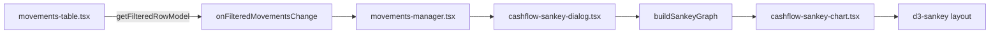

# Cashflow — Grafico Sankey dati filtrati

**Data:** 2026-06-06  
**Stato:** Approvato

## Contesto

La pagina cashflow mostra movimenti in una griglia TanStack Table con filtri colonna client-side. I totali filtrati sono già calcolati da `getFilteredRowModel()`. L'utente vuole visualizzare un **grafico Sankey** dei **medesimi dati filtrati**, con categorie **gerarchiche** (separatore `.`, es. `casa.mutuo`, `monade.stipendio`).

Decisioni prese in brainstorming:

- Modello **Entrate → centro ← Uscite** con gerarchia espansa su entrambi i lati.
- Entrate fluiscono **destra → sinistra** verso il centro; uscite **centro → destra**.
- Movimenti senza categoria: **due nodi** distinti («Senza categoria» entrate / uscite).
- Squilibrio periodo: nodo **«Avanzo»** (entrate > uscite) o **«Disavanzo»** (uscite > entrate).
- Padre con movimenti diretti + figli: importo sul padre = totale; link ai figli = importo figlio; quota diretta resta **porzione terminale del nodo padre** (senza foglia sintetica).
- Altezza nodi **proporzionale al flusso** (standard Sankey).
- UI: pulsante sopra la griglia → **modal** shadcn.
- Libreria: **`d3-sankey`** + SVG custom (no query server aggiuntive).

## Obiettivi

1. Visualizzare flusso entrate/uscite coerente con ciò che l'utente vede in griglia (periodo + vista + share + filtri colonna).
2. Esporre gerarchia categorie a livelli multipli via path `.`.
3. Rendere visibile avanzo/disavanzo del periodo filtrato.
4. Mantenere logica grafo testabile in pure functions separate dal rendering.

## Modello del grafo

### Layout (sinistra → destra)

```
[uscite foglie] ← [uscite padri] ← [CENTRO] → [entrate padri] → [entrate foglie]
                                    ↕
                              [Avanzo / Disavanzo]
```

### Esempi

**Entrate** (`monade.stipendio` = 100, `monade.rimborsi` = 50):

- Nodi foglia `stipendio` (100) e `rimborsi` (50) a destra.
- Link → nodo `monade` (150) → nodo centrale.

**Uscite** (`casa.mutuo` = 100, `casa.corrente comune` = 50):

- Link centro → `casa` (150) → `mutuo` (100) e `corrente comune` (50).

**Padre + figli** (`casa` = 50 diretto, `casa.mutuo` = 100):

- Centro → `casa` (150); `casa` → `mutuo` (100); 50 restano porzione terminale del nodo `casa`.

### Etichette

| Tipo nodo | Etichetta visibile | Tooltip |
|-----------|-------------------|---------|
| Foglia | Ultimo segmento (`mutuo`, `stipendio`) | Path completo + importo € |
| Radice / intermedio | Segmento del livello (`casa`, `monade`) | Path completo + importo € |
| Centro | «Totale periodo» | Σ entrate, Σ uscite |
| Squilibrio | «Avanzo» / «Disavanzo» | Importo squilibrio |
| Senza categoria | «Senza categoria» | Tipo (entrata/uscita) + importo |

### Colori

- Entrate: verde (token tema).
- Uscite: rosso (token tema).
- Centro, Avanzo, Disavanzo, Senza categoria: neutro / muted.

## Requisiti

| ID | Requisito |
|----|-----------|
| R1 | Input Sankey = movimenti da `getFilteredRowModel()` (stesso subset della griglia) |
| R2 | Nessuna query Supabase aggiuntiva |
| R3 | Gerarchia categorie: split su `.`; profondità arbitraria |
| R4 | `category_name` null → nodo «Senza categoria» sul lato entrata o uscita |
| R5 | Due nodi «Senza categoria» distinti (entrate vs uscite) |
| R6 | Entrate: flusso foglie → padri → centro (destra → sinistra) |
| R7 | Uscite: flusso centro → padri → foglie (sinistra → destra) |
| R8 | Se Σ entrate > Σ uscite → link centro → «Avanzo» per la differenza |
| R9 | Se Σ uscite > Σ entrate → link «Disavanzo» → centro per la differenza |
| R10 | Se Σ entrate = Σ uscite → nessun nodo squilibrio |
| R11 | Padre con quota diretta: altezza nodo = totale; link figli = importo figlio; resto terminale sul padre |
| R12 | Altezza nodi proporzionale al flusso (layout Sankey standard) |
| R13 | Pulsante «Grafico Sankey» sopra la griglia; apre modal shadcn |
| R14 | Pulsante disabilitato se zero movimenti filtrati |
| R15 | Modal: titolo, intervallo date, badge se filtri colonna attivi |
| R16 | Legenda: entrate / uscite / avanzo / disavanzo |
| R17 | Chart responsive: min-height ~400px; scroll orizzontale su mobile se necessario |
| R18 | Nomi lunghi troncati (~20 char) in etichetta; completi in tooltip |

## Architettura

### Nuovi file

| File | Ruolo |
|------|--------|
| `lib/cashflow/sankey.ts` | Pure functions: `buildSankeyGraph(movements)` → `{ nodes, links }` |
| `lib/cashflow/sankey.test.ts` | Test unitari costruzione grafo |
| `components/cashflow/cashflow-sankey-chart.tsx` | Layout `d3-sankey` + rendering SVG, tooltip |
| `components/cashflow/cashflow-sankey-dialog.tsx` | Modal: metadati periodo + chart |

### Modifiche esistenti

| File | Modifica |
|------|----------|
| `components/cashflow/movements-table.tsx` | Callback `onFilteredMovementsChange(movements: Movement[])` |
| `components/cashflow/movements-manager.tsx` | Stato `filteredMovements`; pulsante + dialog Sankey |
| `docs/MANUAL_TEST.md` | Sezione test manuale Sankey |
| `package.json` | Dipendenza `d3-sankey`; dev `@types/d3-sankey` |

### Flusso dati



### `lib/cashflow/sankey.ts`

Tipi esportati (indicativi):

```ts
export type SankeyNodeKind =
  | "center"
  | "income"
  | "expense"
  | "uncategorized-income"
  | "uncategorized-expense"
  | "surplus"
  | "deficit";

export type SankeyGraphNode = {
  id: string;
  label: string;
  fullPath: string | null;
  kind: SankeyNodeKind;
  value: number;
  depth: number;
};

export type SankeyGraphLink = {
  source: string;
  target: string;
  value: number;
};

export type SankeyGraph = {
  nodes: SankeyGraphNode[];
  links: SankeyGraphLink[];
};

export function buildSankeyGraph(movements: Movement[]): SankeyGraph;
```

**Algoritmo `buildSankeyGraph`:**

1. Partiziona movimenti per `type` (`income` / `expense`).
2. Per ciascun movimento, determina path (split `.`) o bucket «Senza categoria».
3. Accumula importi per path esatto (nodo foglia) e propaga ai prefissi (padri).
4. Crea link gerarchici padre↔figlio con valore = importo sul path figlio.
5. Collega radici di primo livello al nodo centrale.
6. Calcola Σ entrate, Σ uscite; aggiungi nodo/link Avanzo o Disavanzo se necessario.
7. Per padri con importo diretto sul path padre: `linkValue(figlio)` = importo figlio; `nodeValue(padre)` = somma diretta + discendenti; porzione diretta = terminale sul padre.

**Conservazione flussi:** il grafo emesso deve essere bilanciato al nodo centrale (entrate + eventuale Disavanzo = uscite + eventuale Avanzo). Per padri parzialmente terminali, la quota diretta è assorbita nel valore del nodo senza link uscente aggiuntivo.

### `components/cashflow/cashflow-sankey-chart.tsx`

- Riceve `SankeyGraph`.
- Applica `d3-sankey` per posizionamento nodi/link.
- SVG: rettangoli nodi (altezza ∝ valore), path link, etichette, hover tooltip.
- Fallback UI se layout degenerato (0 link).

### `components/cashflow/cashflow-sankey-dialog.tsx`

Props: `open`, `onOpenChange`, `movements`, `from`, `to`, `filtersActive`.

## Comportamenti edge

| Scenario | Comportamento |
|----------|---------------|
| Zero movimenti filtrati | Pulsante disabilitato |
| Solo entrate | Grafo con uscite assenti; tutto su «Avanzo» |
| Solo uscite | Grafo con entrate assenti; tutto su «Disavanzo» |
| Categoria mono-segmento (`spesa`) | Radice collegata al centro, nessun intermedio |
| Path profondo (`a.b.c.d`) | Colonne automatiche per profondità |
| Filtri colonna attivi | Badge nel modal; dati = subset filtrato |
| Modal aperto + cambio filtri | Chart si aggiorna con nuovi `filteredMovements` |
| Importi | Sempre positivi (dominio movimenti) |

## Errori

| Condizione | Comportamento |
|------------|---------------|
| Grafo senza link ma movimenti presenti | Messaggio «Nessun dato da visualizzare» nel modal |
| Layout d3 fallisce | Messaggio generico; nessun crash |

Nessun toast o errore server — elaborazione interamente client-side.

## Test

### Unitari (`sankey.test.ts`)

1. Gerarchia uscite: `casa.mutuo` + `casa.corrente comune`.
2. Gerarchia entrate: `monade.stipendio` + `monade.rimborsi`.
3. Senza categoria: nodi distinti entrate/uscite.
4. Squilibrio positivo → «Avanzo»; negativo → «Disavanzo»; bilanciato → assente.
5. Padre + quota diretta: `casa` + `casa.mutuo`.
6. Bilanciamento flussi al nodo centrale.

### Manuale (`MANUAL_TEST.md`)

- Aprire cashflow con movimenti categorizzati gerarchicamente.
- Applicare filtro colonna; aprire Sankey; verificare coerenza totali con card filtrate.
- Periodo con avanzo/disavanzo; verificare nodo squilibrio.
- Movimenti senza categoria su entrambi i tipi.

## Fuori scope

- Export PNG/PDF del grafico.
- Drill-down interattivo (click nodo → filtra griglia).
- Sankey su dati non filtrati bypassando la griglia.
- Nuove categorie o modifiche schema DB.

## Approccio tecnico scartato

| Opzione | Motivo esclusione |
|---------|-------------------|
| `@nivo/sankey` | Meno controllo su nodi parzialmente terminali e theming |
| `echarts-for-react` | Bundle eccessivo per una sola feature |
| Sezione inline / tab | Scelta UX: modal (A) |
